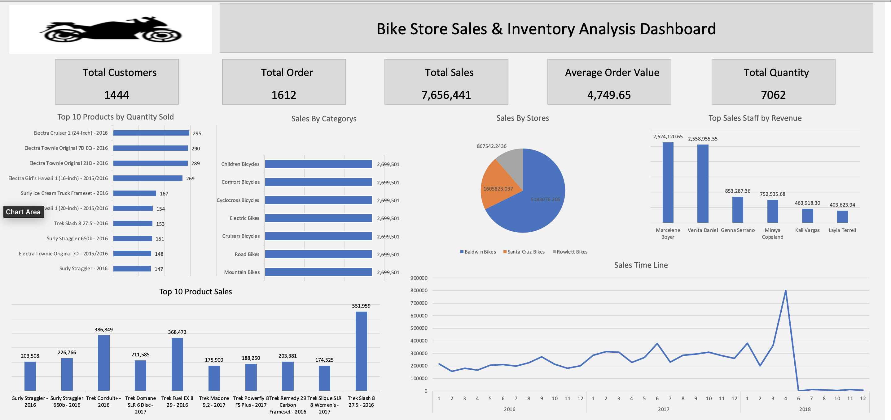

Bike Store Sales & Inventory Analysis Dashboard

Overview

This project analyzes the Bike Store database using SQL Server and Excel to provide insights into sales performance, customer activity, inventory levels, and store performance.

Tools Used

- SQL Server
- Excel
- GitHub

Database

The project includes:

- Database creation scripts
- Table creation scripts
- Data insertion scripts

KPIs

- Total Sales
- Total Orders
- Average Order Value
- Total Customers
- Total Quantity Sold

Dashboard Features

- Sales Trend Analysis
- Top 10 Products by Sales
- Top 10 Products by Quantity Sold
- Sales by Category
- Sales by Store
- Top Sale Staff by Revenue
- Inventory Analysis

Business Questions Answered

- What is the total sales revenue?
- Which products generate the highest sales?
- Which products sell the highest quantity?
- Which store performs best?
- Who are the top sales representatives?
- Which products are running low in inventory?

Dashboard Preview

Author

Abdalla Ghanem
